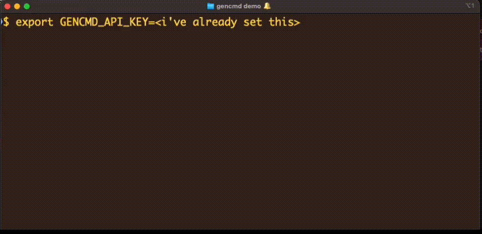

# gencmd
Generate cmd line arguments from the terminal itself. 

You're on your terminal typing out a command and you're trying, unsuccessfully, to recall the right cmd line arguments. What's your workflow then? Shift to your browser, run a search, click through multiple links, read through multiple pages, and then finally find the right command line arguments? That's distracting. With `gencmd` your workflow continues in the command line itself.

Uses Google's PaLM API. 

### Examples



These are generated. So you might see different results each time you run it..
```	
gencmd -n 5 -t 0.9 convert the first 10 seconds of an mp4 video into a gif
# -n is the number of results
# -t is the temperature.

ffmpeg -ss 00:00:10 -i input.mp4 -vcodec gif -pix_fmt rgb24 -t 00:00:10 output.gif
ffmpeg -ss 00:00:00 -i input.mp4 -t 00:00:10 -vf "scale=320:-1,fps=25,format=gif" output.gif
ffmpeg -ss 00:00:10 -i input.mp4 -vf "fps=10,scale=320:-1" output.gif
ffmpeg -ss 00:00:10 -i input.mp4 -vf scale=320:-1 -pix_fmt yuv420p output.gif
ffmpeg -i input.mp4 -vf "trim=0:10" output.gif
```

```
gencmd -i -c grep find txt files that contain the text hello
# -c specifies the command to use. In this case, grep.
# -i enables interactive mode. This copies the command to clipboard.

1: grep -r hello *.txt
2: grep "hello" *.txt
3: grep -r "hello" *.txt
4: grep -i hello *.txt

Number to copy to clipboard. q to quit. Enter your choice: 3
Copied suggestion 3 to clipboard.

$ [cmd/ctrl+v] grep -r "hello" *.txt
```

```
gencmd -o windows -n 1 find files that has extension pdf
# -o specifies the operating system. In this case, windows.

dir /s *.pdf
```

```
gencmd -c git -n 2 recursively remove a directory from git but not from local
gencmd -c gcloud delete a vm named instance-1 in iowa region zone a
gencmd -c kubectl delete a pod named hello in namespace n2
```

### Requires PaLM API key
This works with Google's PaLM API. You need to have an API key for it to work. 
If you have access to MakerSuite, you can get it from there: [MakerSuite - Get API key](https://makersuite.google.com/app/apikey). 
As of now, access is limited by Google. So you might have to put yourself on the waitlist.

### Installation
Linux Users: Please install xsel, xclip, wl-clipboard or Termux:API add-on for termux-clipboard-get/set. This is required for the interactive mode to work to copy to clipboard. You can skip this if you don't want to use the interactive mode.
E.g. `sudo apt-get install xsel`

Here are the steps for unix based systems (Mac, Linux). The steps for Windows should be similar.

#### 1. Download the binary for your OS and architecture from the releases directory: 

Example for Apple Silicon
```
wget https://github.com/sathishvj/gencmd-go/raw/main/releases/darwin-arm64/gencmd 
chmod +x gencmd 
./gencmd -h
```

If you don't have wget, then maybe curl will work for you. Example for Windows:
```
curl -o gencmd -L https://github.com/sathishvj/gencmd-go/raw/main/releases/windows-amd64/gencmd.exe
gencmd -h
```

Available builds right now are:
 - darwin-amd64/gencmd
 - darwin-arm4/gencmd
 - linux-amd64/gencmd
 - linux-arm644/gencmd
 - windows-amd64/gencmd.exe
 - windows-arm644/gencmd.exe

#### 2. Export the API key.
For unix systems:
```
export GENCMD_API_KEY=<your api key>
```

For windows, I think it is:
```
set GENCMD_API_KEY=<your api key>
```
You need to get this API key from [MakerSuite - Get API key](https://makersuite.google.com/app/apikey), if you have access.

#### 3. Run a basic command to test it out.
```
./gencmd -o unix -c grep find txt files that contain the text hello
```

#### 4. More Permanent Options
 - You can add the binary to your PATH.
 - You can add the export command for the API key to your .bashrc or .zshrc or .profile file. On windows, you can do it in the System Settings->Environment variables GUI.

### Options
```
 -c Command/Programme to use. Example: grep, ffmpeg, gcloud, curl. Default is empty.
 -n Number of results to generate. Max 10. Default is 4. (default 4)
 -o Operating system. Example: unix, linux, windows (default "unix")
 -t Temperature [0.0-1.0]. Default is 0.9. (default 0.9)
 -i Interactive mode. Copy command to clipboard. Default off.
 -y Year (included) post which the cmd is likely to have been used. This attempts to avoid older versions and options. Example: 2021, 2020, 2019. Default is none.
 
 -h	Show usage.
 -v	Verbose. Default off.
 -version Show version of this build.
 -l	Show line numbers. Default off.
```

### Warning!
Google's policies say they can use your data. So don't use this with sensitive data.

## License
MIT License.